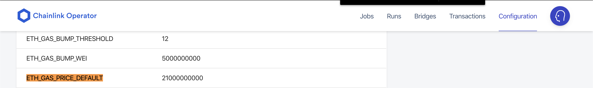

# chainlink-gas

Automatic updater for gas prices in a chainlink node.

## Usage
1. Put the script somewhere and make it executable.

```chmod +x setgasprice.sh```

2. Change the minimum gas you want to use and your chainlink directory in the script.
   
```MINIMUMGAS=10000000000```

3. Test the job

```bash setgasprice.sh ```

Sample Successful response:
```
Gassprices: 200 100 80
Fastest gas is : 20000000000 New gas is : 21000000000 Final gas is : 21000000000
Logged in: true
{
  "Old": "21000000000",
  "New": "21000000000"
}
```
The "New" price is what you will see in the GUI.



4. Add the script to the crontab for every minute.

```crontab -e```

```* * * * * /path/to/file/setgasprice.sh```


# Notes 

To check to see if it's run correctly, wait a minute, then run:

``` grep "setgasprice.sh" /var/log/syslog ```

This should give you the logging for the cron jobs (replace ```/var/log/syslog``` with your cron log location)

